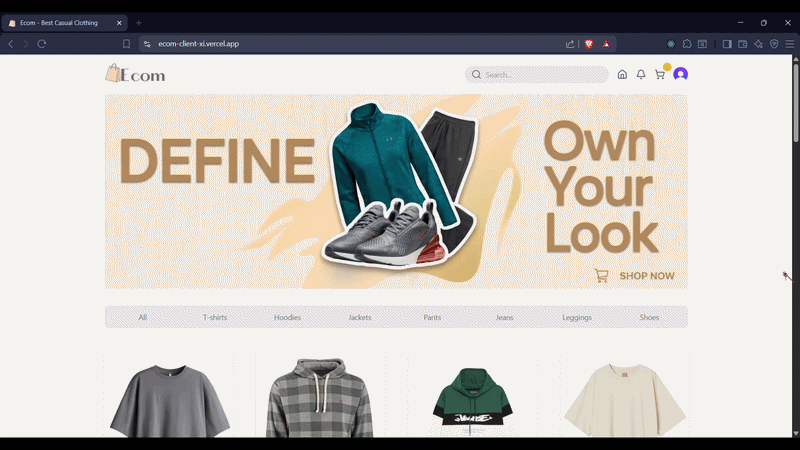
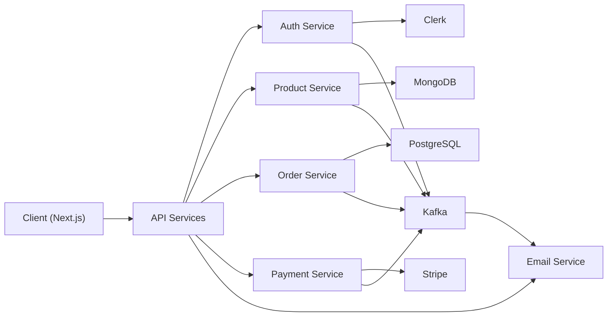

<p align="center">
  
</p>

<h4 align="center">
  A full-stack e-commerce platform built with a microservices architecture, where users can browse products, manage carts, place orders, and complete secure payments through a seamless shopping experience.
  The platform uses independent services for authentication, products, orders, payments, and notifications, connected through event-driven communication for reliable and scalable workflows.
</h4>

---

<h2 align="center">Features</h2>

<table>
  <colgroup>
    <col style="width:40%">
    <col style="width:60%">
  </colgroup>

  <tr>
    <th align="left">Module</th>
    <th align="left">Description</th>
  </tr>

  <tr>
    <td><strong>Authentication</strong></td>
    <td>User authentication and authorization with secure session management.</td>
  </tr>

  <tr>
    <td><strong>Product Management</strong></td>
    <td>Create, manage, and display products with organized product information.</td>
  </tr>

  <tr>
    <td><strong>Product Browsing</strong></td>
    <td>Browse products and view detailed product information.</td>
  </tr>

  <tr>
    <td><strong>Shopping Cart</strong></td>
    <td>Add, remove, and manage products before completing checkout.</td>
  </tr>

  <tr>
    <td><strong>Order Management</strong></td>
    <td>Create orders, track order status, and manage the complete order workflow.</td>
  </tr>

  <tr>
    <td><strong>Payment Processing</strong></td>
    <td>Stripe integration for secure payments and payment confirmation.</td>
  </tr>

  <tr>
    <td><strong>Real-Time Updates</strong></td>
    <td>Receive real-time payment updates using WebSockets.</td>
  </tr>

  <tr>
    <td><strong>Email Notifications</strong></td>
    <td>Send automated emails for order confirmations and important updates.</td>
  </tr>

  <tr>
    <td><strong>Admin Dashboard</strong></td>
    <td>Manage products, orders, and platform operations through an admin interface.</td>
  </tr>

  <tr>
    <td><strong>Microservices Architecture</strong></td>
    <td>Independent services for authentication, products, orders, payments, and emails with event-driven communication.</td>
  </tr>

  <tr>
    <td><strong>Shared Packages</strong></td>
    <td>Reusable packages for shared types, Kafka utilities, and centralized logging.</td>
  </tr>

</table>

---

<h2 align="center">Feature Demonstration</h2>

<p align="center">
  
</p>

<p align="center">
  Complete application flow including product browsing, cart management, checkout, payment, and order processing.
</p>

---

<h2 align="center">Architecture</h2>



---

<h2 align="center">Tech Stack</h2>

### Frontend


### Backend


### Database & Infrastructure


### Services & Tools


---

<h2 align="center">Project Structure</h2>

```text
ecommerce-app/
│
├── admin/                         # Admin dashboard application
│   ├── src/
│   ├── public/
│   └── package.json
│
├── client/                        # Customer-facing Next.js application
│   ├── src/
│   │   ├── app/                   # Application routes and pages
│   │   ├── components/            # Reusable UI components
│   │   └── lib/                   # Client utilities
│   └── package.json
│
├── auth-service/                  # Authentication microservice
│   ├── src/
│   │   ├── lib/
│   │   ├── middleware/
│   │   ├── routes/
│   │   └── services/
│   └── package.json
│
├── product-service/               # Product management microservice
│   ├── prisma/
│   ├── src/
│   │   ├── controllers/
│   │   ├── lib/
│   │   ├── middleware/
│   │   └── routes/
│   └── package.json
│
├── order-service/                 # Order processing microservice
│   ├── src/
│   │   ├── config/
│   │   ├── lib/
│   │   ├── middleware/
│   │   ├── models/
│   │   ├── routes/
│   │   └── services/
│   └── package.json
│
├── payment-service/               # Payment processing microservice
│   ├── src/
│   │   ├── lib/
│   │   ├── middleware/
│   │   ├── routes/
│   │   └── services/
│   └── package.json
│
├── email-service/                 # Email notification microservice
│   ├── src/
│   │   ├── lib/
│   │   ├── routes/
│   │   └── services/
│   └── package.json
│
├── packages/                      # Shared packages
│   ├── kafka/                     # Kafka producer and consumer utilities
│   ├── logger/                    # Centralized logging utilities
│   └── types/                     # Shared TypeScript types
│
├── docker-compose.yml             # Local service orchestration
├── pnpm-workspace.yaml            # PNPM monorepo configuration
├── pnpm-lock.yaml
├── package.json
├── tsconfig.base.json
└── .dockerignore
```

---

<h2 align="center">Getting Started</h2>

### 1. Clone the Repository

```bash
git clone https://github.com/nnuvi/ecommerce-app.git
```

### 2. Install Dependencies

```bash
npm install
```

### 3. Start Development Environment

```bash
docker compose up
```

### 4. Start Application

```bash
npm run dev
```

---

<h2 align="center">Deployment</h2>

- Client: Vercel
- Backend Services: Render
- Containerized using Docker

<!-- ---

<h2 align="center">Live Demo</h2>

https://ecom-client-xi.vercel.app/ -->

---

<h2 align="center">Future Improvements</h2>

- Add advanced admin features for managing products, orders, and users.
- Add product reviews, ratings, and customer feedback.
- Improve product search with filtering, sorting, and better discovery.
- Add wishlist and saved products functionality.
- Add discount codes, coupons, and promotional features.
- Improve checkout experience and order flow.
- Add better loading states, empty states, and error handling across the application.
- Improve responsive UI and add theme customization options.
- Add more account settings and user customization features.
- Add order tracking and improved order history.
- Improve authentication security and account protection.
- Improve monitoring, logging, and overall system performance.
<!-- - Add automated testing for services and applications.
- Enhance CI/CD workflow and deployment process. -->

---

<!-- <h2 align="center">Notes</h2>

This project demonstrates microservices architecture, event-driven communication, distributed services, and scalable backend design patterns. -->


<!-- # E-Commerce Microservices Platform

A full-stack e-commerce application built using a microservices architecture. The system includes separate services for authentication, products, orders, payments, and email notifications, along with a client and admin application.

---

## Features

- User authentication and authorization
- Product listing and management
- Shopping cart functionality
- Order processing system
- Stripe payment integration
- Real-time payment confirmation (WebSockets)
- Email notifications for orders
- Admin dashboard for managing products and orders

---

## Architecture

- auth-service
- product-service
- order-service
- payment-service
- email-service
- client (Next.js)
- admin panel
- shared packages (types, kafka, logger)

---

## Tech Stack

- Node.js
- Next.js
- React.js
- Express.js / Fastify / Hono
- PostgreSQL
- MongoDB
- Kafka
- Prisma
- Docker
- Stripe
- Clerk
- WebSockets

---

## Shared Packages

- Kafka utilities
- Type definitions
- Logger system

---

## Deployment

- Client: Vercel
- Backend Services: Render
- Containerized using Docker

---

## Live Demo

https://ecom-client-xi.vercel.app/

---

## Notes

This project demonstrates microservices architecture, event-driven communication, and scalable backend design. -->
